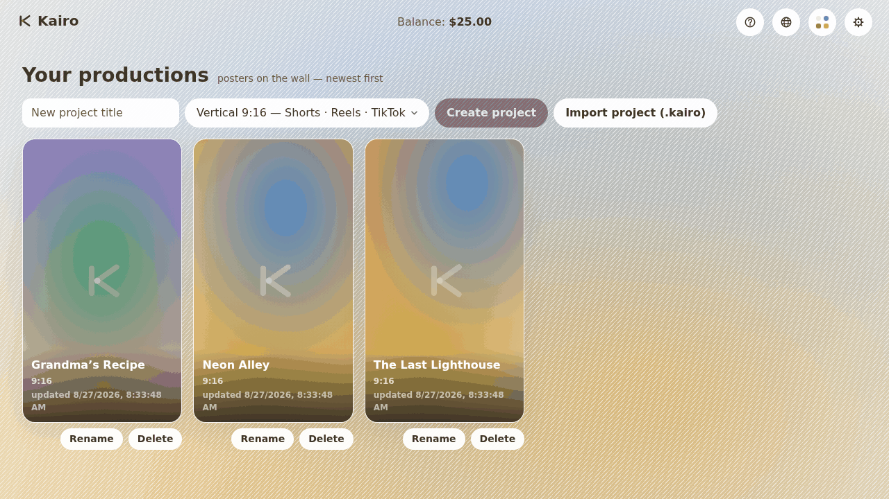
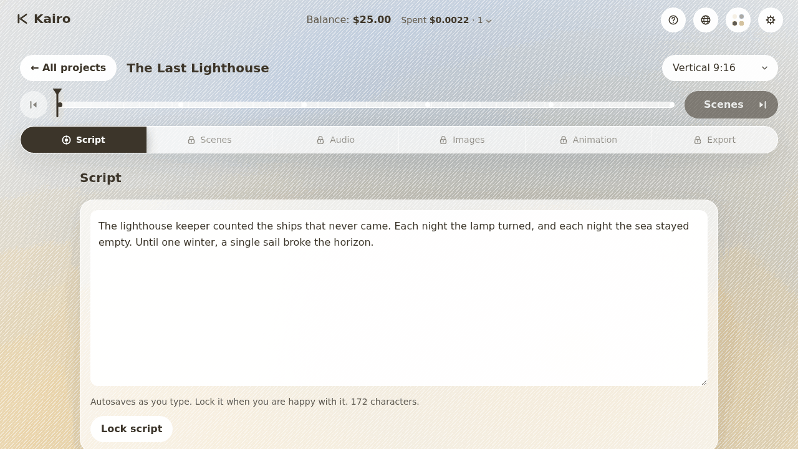
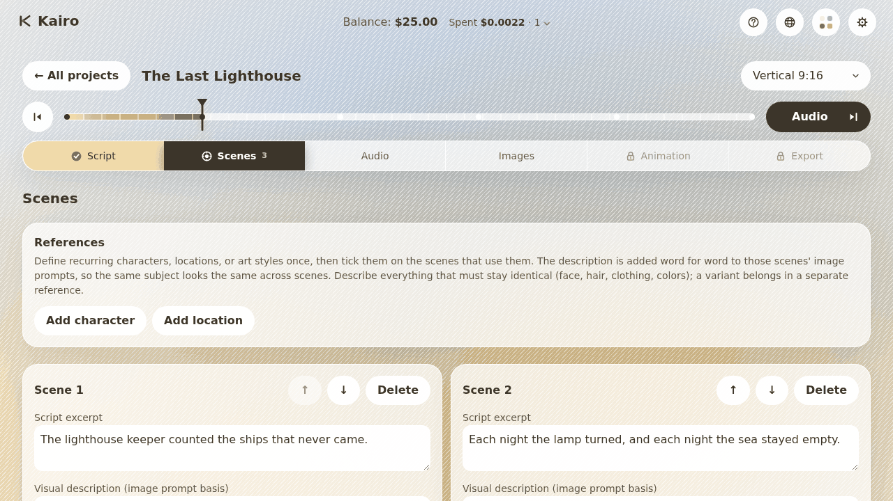

# Kairo

**A film studio that fits in a browser tab.**

Write a script. Kairo breaks it into scenes, narrates them, paints them,
animates them, and hands you a finished video — Shorts to widescreen to
cinematic, in any format you choose. Every step runs on _your own_
[NanoGPT](https://nano-gpt.com/r/BnfJfghE) API key, so you pick the model at
each stage and pay exactly what NanoGPT charges for it — no subscription, no
markup, no account with Kairo itself, because there is no server to have an
account with.

_(That NanoGPT link is a referral: signing up through it supports Kairo's
development at no extra cost to you. It's the project's only monetization.)_

<p align="center">
  
</p>

## Why it exists

Every "AI video" product either locks the good models behind a monthly plan
or hides its margins inside a credit system you can't audit. Kairo does
neither. It's a thin, honest client over the model APIs: you bring the key,
you see the price before you spend it, and the app takes nothing for itself.
Because it never talks to a server of its own, there's also nothing to leak —
your key, your script, and every image and clip you generate stay on your
device, in your browser's own storage.

## The pipeline

Six stages, one project, every take kept so you can always switch back.

| Stage             | What happens                                                                                                     |
| ----------------- | ---------------------------------------------------------------------------------------------------------------- |
| **1 · Script**    | Write it yourself or draft it with a text model — then lock it as the source of truth for everything downstream. |
| **2 · Scenes**    | One click proposes a scene breakdown (excerpt + visual description per scene), fully editable and reorderable.   |
| **3 · Audio**     | Audition any voice for a fraction of a cent before committing; narration is priced to the cent, per scene.       |
| **4 · Images**    | Every scene is painted in your project's format. Generate multiple takes per scene and pick the one that works.  |
| **5 · Animation** | Stills become motion — including lip-synced talking scenes generated from a single still.                        |
| **6 · Export**    | Numbered clips for your own editor, or one stitched draft MP4. Stills and narration included. No watermark.      |

<p align="center">
  
  &nbsp;
  
</p>

You can leave and come back at any point — every generation is a persisted,
resumable job. Close the tab mid-render on a slow video model and Kairo
picks the job back up and collects your clip when you return.

## What makes it more than a wrapper

- **References, for consistency.** The single hardest problem with
  AI-generated video is that a character described twice comes out as two
  different people. Kairo's References panel lets you define a character,
  location, or art style once — with a text descriptor and, optionally, a
  reference image — then tick which scenes use it. The descriptor is
  injected verbatim into every ticked scene's prompt, and the image rides
  along via image-to-image on models that support it. Nothing is silently
  dropped: if your chosen model can't take reference images, Kairo says so
  up front instead of pretending.
- **Style presets, and styles pulled from a photo.** Pick a visual style for
  the whole project, or describe one in your own words and let Kairo turn it
  into a reusable preset — even from a reference photo you upload.
- **Any format, one project.** Vertical, widescreen, square, portrait, or
  cinematic — set at creation, editable later. Everything downstream (the
  resolution picked from your model's supported sizes, the prompts, every
  frame in the UI) derives from that one choice.
- **Cost, shown before you commit.** Every generation — script, scene
  breakdown, voice line, image, clip — shows its price before you press
  the button, and its actual cost afterward. A running spend log, per
  project and per account, means you never wonder where the balance went.
- **A real pipeline, not a chat window.** Each stage is gated on the one
  before it actually being done (a locked script, a non-empty scene list),
  so you can't accidentally generate clips for scenes that don't exist yet.
- **Works offline, once loaded.** Kairo is an installable Progressive Web
  App with a service worker and no server-rendered anything — open it once,
  and the app shell keeps working without a connection (generation itself,
  naturally, still needs the network to reach NanoGPT).
- **Ten languages, right-to-left included.** The interface speaks English,
  Mandarin, Hindi, Spanish, French, Arabic, Bengali, Portuguese, Russian,
  and Urdu, with Arabic and Urdu properly mirrored — not just flipped text,
  but a UI that reads correctly in both directions.

## Getting started

You'll need a [NanoGPT](https://nano-gpt.com/r/BnfJfghE) account and API
key — Kairo walks you through pasting it in on first launch and validates it
against your balance before you generate anything. From there:

```bash
git clone https://github.com/Angel-Casas/kairo.git
cd kairo
npm install
npm run dev          # http://localhost:5173
```

No build step, no backend to stand up, no environment variables to set.
Open the URL, paste your key, start a project.

## How it's built

Kairo is a client-side-only React 19 + TypeScript app, on purpose — see
[`docs/DECISIONS.md`](./docs/DECISIONS.md) for the full reasoning behind
every architectural call, from "why no backend" to "why AGPL."

- **UI:** React 19, Vite, strict TypeScript, zustand for state.
- **Storage:** IndexedDB for project data, OPFS for generated media — both
  local to your browser, nothing uploaded anywhere but NanoGPT itself.
- **Generation:** a typed client over the NanoGPT API for text, image, TTS,
  and video-generation endpoints, with async job polling for the
  slower-to-render stages.
- **Packaging:** an installable PWA (manifest + service worker,
  auto-updating), so it behaves like a native app once installed.
- **Export:** clip zipping and draft stitching run client-side via
  `ffmpeg.wasm` — no upload, no render farm.

```bash
npm test          # unit tests (Vitest)
npm run e2e       # end-to-end tests (Playwright; npx playwright install first)
npm run lint      # lint (oxlint)
npm run format    # format with Prettier
npm run build     # typecheck + production build
```

## Project docs

- [`docs/ROADMAP.md`](./docs/ROADMAP.md) — the slice-by-slice build log,
  what's shipped and what's next.
- [`docs/DECISIONS.md`](./docs/DECISIONS.md) — the architecture decision
  records behind the app's shape.
- [`CHANGELOG.md`](./CHANGELOG.md) — what changed, release to release.
- [`CLAUDE.md`](./CLAUDE.md) — conventions for working on the codebase.

## License

[AGPL-3.0-or-later](./LICENSE). The code is open specifically so the claim
that your key and your media never leave your device is something you can
go verify yourself, rather than something you have to take on faith.
